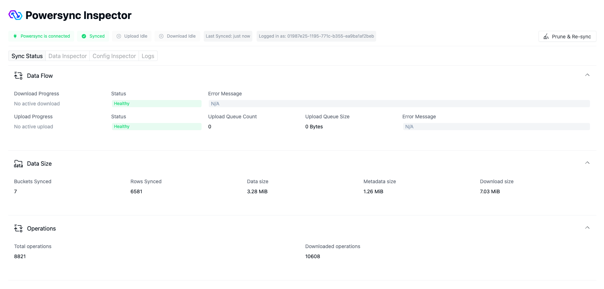
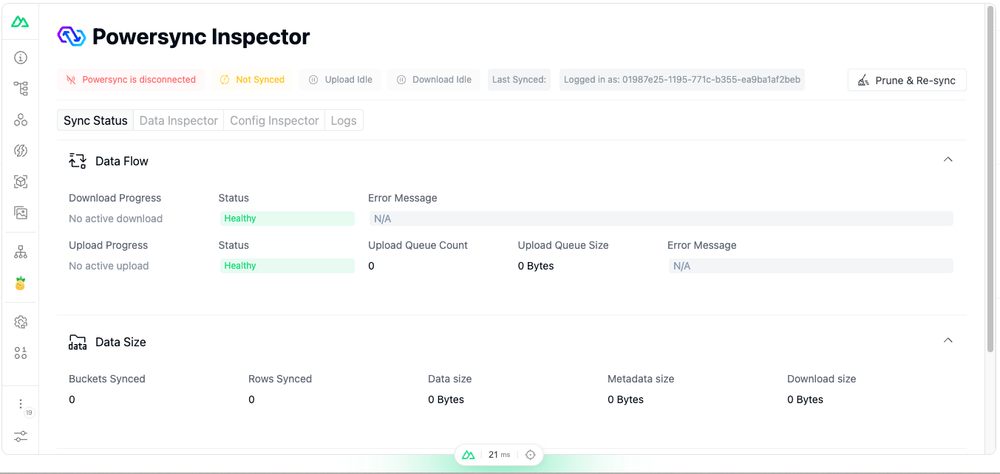

# Overview

PowerSync Inspector is a tool that helps inspect and diagnose the state of your PowerSync client directly from your app in real-time.

## Setup

To setup the PowerSync inspector, you need to follow the steps in the [Getting Started](/guide/getting-started) guide.

Once setup the inspector can be accessed on the `http://localhost:3000/__powersync-inspector` route. or via the [Nuxt Devtools](./#nuxt-devtools).

## Features

### Sync Status

The `Sync Status` tab is a real-time view of the sync status of your PowerSync client.

### Data Inspector

TODO

### Config Inspector

TODO

### Logs

TODO

### Nuxt Devtools

The inspector is also available in the Nuxt Devtools as a tab.

## Known Issues

The sync status tab might glitch when operating in a multi-tab environment. you can observe this issue when you open the inspector in the devtools for example.